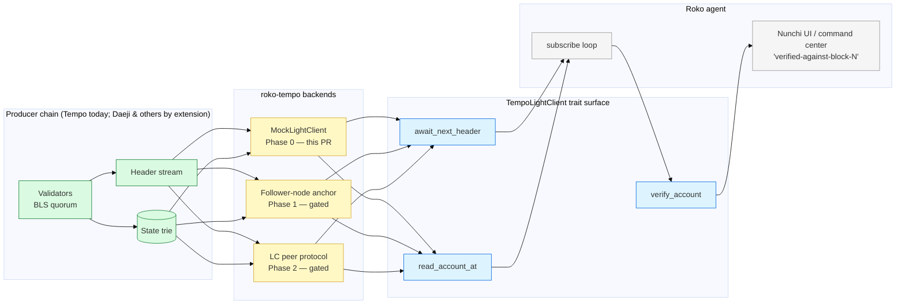

# 25 — Tempo Light Client (agent-side)

> **Status:** draft (Phase 0 — mock backend shipping in this PR)
> **Owner:** jl
> **Date:** 2026-05-05
> **Scope:** agent-side trait + Tempo-shaped façade. Producer chain (Tempo / Daeji) is out of scope — those live in `Nunchi-trade/collaboration` PRs #143 / #144 / #145.

## TL;DR

Roko agents need a way to consume external chain state with cryptographic verification — no RPC trust, no oracle relayer, no bridge. The Workstream A artifact from the 2026-05-01 Jacob × Jae × JD Tempo+Oracle call ([call analysis](https://github.com/Nunchi-trade/collaboration/pull/144)) is exactly that: an agent acting as a light client of an external chain, rendering verified state inside the Nunchi UI / agent command center.

This doc specifies the agent-side surface: a chain-agnostic `LightClient` trait + a Tempo-shaped `TempoLightClient` façade, both now living in `crates/roko-tempo`. The crate ships with a deterministic mock backend so tests and demos run with no network, plus a runnable example (`cargo run -p roko-tempo --example tempo_tail`). Real network backings (commonware-p2p follower-node anchor → LC peer) swap in behind a feature flag in later phases without changing the trait surface.

## Why this is the right artifact

From the call (verbatim, JD): *"if we're saying it's like 50 milliseconds and sub metal, what type of data is coming through here?"* and Jacob's framing: *"the big advantage of that is, like, when they consume data, that data is proven. There's no potential for fraud."*

The light-client agent is:

- **Cheapest, highest-signal partnership artifact.** No bridge to build. No contract on Tempo. No permission required from Tempo (consumes public Tempo state — same as any block explorer).
- **Cryptographically grounded.** Provability replaces RPC trust. The agent verifies headers against the producer chain's BLS quorum and walks Merkle proofs against the verified state root.
- **A user before being a partner.** The conversation-opener that does not look like a BD email.
- **Reusable.** The same trait surface works for Daeji (Nunchi's L1) and any other commonware-based chain. We are writing one LC primitive, not a Tempo-specific one.

## Architecture



The trait surface is stable across phases. Only the backend changes.

## Trait surface

```rust
#[async_trait]
pub trait LightClient: Send + Sync {
    fn name(&self) -> &str;
    fn latest_verified(&self) -> Option<VerifiedHeader>;
    async fn await_next_header(&self) -> Result<VerifiedHeader, LcError>;
    async fn read_account_at(&self, address: &str, block: BlockNumber)
        -> Result<AccountProof, LcError>;
    fn verify_account(&self, proof: &AccountProof) -> Result<(), LcError>;
}
```

Five methods. Intentionally narrow — the demo only needs subscribe + read + verify. Storage-slot reads, transaction proofs, and historical-range queries are deferred until a concrete agent surface needs them.

## Phase model

| Phase | Backend | Network dep | Cargo feature | Status |
|---|---|---|---|---|
| **0** | `MockLightClient` (deterministic, canned) | none | default | **shipped this PR** |
| 1 | commonware-p2p follower-node anchor | follower socket | `commonware-backend` | not yet wired |
| 2 | commonware-p2p LC peer protocol | LC peer | `commonware-backend` | gated on Tempo's LC protocol shipping |

Per the 2026-05-01 call ("no follower nodes — at least not yet — but we can do the light client proofs"), Phase 1 is the realistic next step once Tempo opens its surface. Phase 2 lands when Tempo ships an LC protocol.

## What this PR is *not*

- **Not** a real Tempo network connection. The mock is structural; it proves the trait surface works end-to-end without misleading consumers about real Tempo state.
- **Not** a bridge. Per `Nunchi-trade/collaboration` PR #144 §7, no bridge until a second live commonware destination beyond Tempo + Noble exists.
- **Not** a contract deployment on Tempo. Workstream A by design bypasses Tempo's enterprise-gated partner form.
- **Not** wired into `roko-cli`. The example binary is the only entry point in v1; `roko tempo-tail` as a first-class subcommand is a follow-up.

## Verification

- 5 unit tests covering: chain advances, proof verifies, unknown account errors clearly, tampered proofs fail, latest-verified tracks the cursor (`cargo test -p roko-tempo`).
- Runnable example produces 5 verified-header lines + clean exit (`cargo run -p roko-tempo --example tempo_tail`).
- `cargo clippy -p roko-tempo --no-deps -- -D warnings` clean.

## Relationship to the Daeji-side architecture

The chain-agnostic trait is intentional. The same write/read separation that #143 §0 / #145 §0 specify on the producer side maps to the consumer side:

| Producer side (Daeji, in `Nunchi-trade/collaboration`) | Consumer side (this crate, on Roko) |
|---|---|
| Native chain state in `crates/node/domain/` | `LightClient::read_account_at` returns `AccountProof` |
| Validator end-of-block write to `OracleState` | `LightClient::await_next_header` yields a `VerifiedHeader` whose `state_root` commits the post-block state |
| BLS quorum attestation (`OracleEvent::Attest`) | `VerifiedHeader::attestation: AttestationSig` |
| EVM read via precompile `0xA0D` | not on the LC surface — the LC is the chain-native subscriber path |

So a Roko agent that consumes Daeji state is a `LightClient` over Daeji; a Roko agent that consumes Tempo state is a `LightClient` over Tempo. One trait, two backends.

## Cross-references

- `Nunchi-trade/collaboration` PR #144 — Tempo Integration Workstreams (Workstream A is this artifact, agent-side).
- `Nunchi-trade/collaboration` PR #143 §0 — Architecture-at-a-glance for the broader feed plane.
- `Nunchi-trade/collaboration` PR #145 §0 — Same for the chain-state Oracle.
- `crates/roko-tempo/README.md` — quick start for the crate.
- `docs/08-chain/17-chain-client-wallet-traits.md` — the existing `ChainClient` trait (EVM-shaped); `LightClient` is a sibling abstraction, not a replacement.
