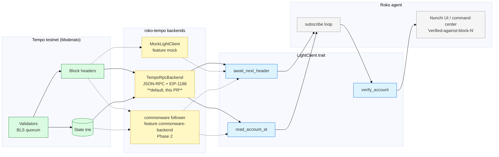

# 25 — Tempo Light Client (agent-side)

> **Status:** real-testnet (Phase 1-RPC) — default backend connects to Tempo "Moderato" testnet
> **Owner:** jl
> **Date:** 2026-05-06
> **Scope:** agent-side trait + Tempo-shaped façade. Producer chain (Tempo / Daeji) is out of scope — those live in `Nunchi-trade/collaboration` PRs #143 / #144 / #145.

## TL;DR

Roko agents need a way to consume external chain state with cryptographic verification — no RPC trust, no oracle relayer, no bridge. The Workstream A artifact from the 2026-05-01 Jacob × Jae × JD Tempo+Oracle call ([call analysis](https://github.com/Nunchi-trade/collaboration/pull/144)) is exactly that: an agent acting as a light client of an external chain, rendering verified state inside the Nunchi UI / agent command center.

This doc specifies the agent-side surface: a chain-agnostic `LightClient` trait + a Tempo-shaped `TempoLightClient` façade, both living in `crates/roko-tempo`. The default backend connects to the Tempo public testnet "Moderato" (`https://rpc.moderato.tempo.xyz`, chain id 42431) and verifies state via EIP-1186 Merkle Patricia trie proofs against each block's `stateRoot`. A `mock` cargo feature offers an in-memory backend for unit tests; a future `commonware-backend` feature will swap in full BLS-attested consensus verification once Tempo opens its consensus-peer surface.

## Why this is the right artifact

From the call (verbatim, JD): *"if we're saying it's like 50 milliseconds and sub metal, what type of data is coming through here?"* and Jacob's framing: *"the big advantage of that is, like, when they consume data, that data is proven. There's no potential for fraud."*

The light-client agent is:

- **Cheapest, highest-signal partnership artifact.** No bridge to build. No contract on Tempo. No permission required (consumes public Tempo state — same as any block explorer, but provably).
- **Cryptographically grounded for state.** EIP-1186 proofs walk locally against the block's `stateRoot`. The RPC operator cannot lie about an account's balance / nonce / storage / code without producing an invalid proof.
- **A user before being a partner.** The conversation-opener that does not look like a BD email.
- **Reusable.** The same trait surface works for Daeji (Nunchi's L1) and any other commonware-based chain. We are writing one LC primitive, not a Tempo-specific one.

## Architecture



The trait surface is stable across backends. Only the backend changes.

## Trust model (RPC + TOFU, current default)

State reads are cryptographically verified — `eth_getProof` returns an MPT proof and `mpt::verify_account_proof` walks it locally against the block's `stateRoot`. This is end-to-end provable: the RPC operator cannot lie about the on-chain account record without producing a hash-mismatched proof.

The header chain is anchored at trust-on-first-use (TOFU) at construction time. Subsequent headers must parent-hash-chain back to the anchor; mismatches are rejected. The remaining gap is the consensus signature on each header — verifying the validator BLS aggregate over the canonical header bytes — which requires a consensus-peer surface that Tempo does not currently expose.

The backend marks itself with `attestation.quorum_id == "tempo-rpc-tofu"` so downstream consumers can tell it apart from a fully-consensus-verified backend.

## Trait surface

```rust
#[async_trait]
pub trait LightClient: Send + Sync {
    fn name(&self) -> &str;
    fn latest_verified(&self) -> Option<VerifiedHeader>;
    async fn await_next_header(&self) -> Result<VerifiedHeader, LcError>;
    async fn read_account_at(&self, address: &str, block: BlockNumber)
        -> Result<AccountProof, LcError>;
    fn verify_account(&self, proof: &AccountProof) -> Result<(), LcError>;
}
```

Five methods. Intentionally narrow — the demo only needs subscribe + read + verify. Storage-slot reads, transaction proofs, and historical-range queries are deferred until a concrete agent surface needs them.

## Phase model

| Phase | Backend | Network dep | Cargo feature | Status |
|---|---|---|---|---|
| 1-RPC | `TempoRpcBackend` (JSON-RPC + EIP-1186 proofs + TOFU header chain) | Tempo testnet | default | **shipped this PR** |
| 1-mock | `MockLightClient` (deterministic in-memory) | none | `mock` | shipped this PR (tests + offline demos only) |
| 2 | commonware-p2p follower-node anchor with full BLS aggregate-sig verification | Tempo consensus peer | `commonware-backend` | gated on Tempo opening its surface |

Per the 2026-05-01 call ("no follower nodes — at least not yet — but we can do the light client proofs"), Phase 2 is the realistic next step once Tempo opens its consensus-peer surface.

## What this PR is *not*

- **Not** consensus-attested. State proofs are real; header attestations are RPC-anchored. Phase 2 closes this.
- **Not** a bridge. Per `Nunchi-trade/collaboration` PR #144 §7, no bridge until a second live commonware destination beyond Tempo + Noble exists.
- **Not** a contract deployment on Tempo. Workstream A by design bypasses Tempo's enterprise-gated partner form.
- **Not** wired into `roko-cli`. The example binary is the only entry point in v1; `roko tempo-tail` as a first-class subcommand is a follow-up (~50 LOC of clap-derive boilerplate against the existing 8000-line `main.rs`).

## Verification

- Unit tests on the mock backend: `cargo test -p roko-tempo --features mock` (5/5 pass; chain advances, proof verifies, unknown account errors clearly, tampered proofs fail, latest-verified tracks the cursor).
- Unit tests on the MPT verifier: `cargo test -p roko-tempo` (empty-account detection, b256 round-trip).
- Live integration tests against Tempo testnet: `ROKO_TEST_RPC_URL=https://rpc.moderato.tempo.xyz cargo test -p roko-tempo --test tempo_live`. Three tests: `live_header_chain_advances`, `live_account_proof_verifies_for_block_miner`, `live_proof_against_wrong_state_root_fails`. Skip-on-unreachable so CI without network egress stays green.
- End-to-end demo: `cargo run -p roko-tempo --example tempo_tail` produces 5 verified-header lines against real Moderato state.
- `cargo clippy -p roko-tempo --all-features --no-deps -- -D warnings` clean.

## Relationship to the Daeji-side architecture

The chain-agnostic trait is intentional. The same write/read separation that #143 §0 / #145 §0 specify on the producer side maps to the consumer side:

| Producer side (Daeji, in `Nunchi-trade/collaboration`) | Consumer side (this crate, on Roko) |
|---|---|
| Native chain state in `crates/node/domain/` | `LightClient::read_account_at` returns `AccountProof` |
| Validator end-of-block write to `OracleState` | `LightClient::await_next_header` yields a `VerifiedHeader` whose `state_root` commits the post-block state |
| BLS quorum attestation (`OracleEvent::Attest`) | `VerifiedHeader::attestation: AttestationSig` (Phase 2 fills the bytes; Phase 1-RPC marks `quorum_id = "tempo-rpc-tofu"` so the gap is visible) |
| EVM read via precompile `0xA0D` | not on the LC surface — the LC is the chain-native subscriber path |

So a Roko agent that consumes Daeji state is a `LightClient` over Daeji; a Roko agent that consumes Tempo state is a `LightClient` over Tempo. One trait, two backends.

## Cross-references

- `Nunchi-trade/collaboration` PR #144 — Tempo Integration Workstreams (Workstream A is this artifact, agent-side).
- `Nunchi-trade/collaboration` PR #143 §0 — Architecture-at-a-glance for the broader feed plane.
- `Nunchi-trade/collaboration` PR #145 §0 — Same for the chain-state Oracle.
- `crates/roko-tempo/README.md` — quick start for the crate.
- `docs/08-chain/17-chain-client-wallet-traits.md` — the existing `ChainClient` trait (EVM-shaped); `LightClient` is a sibling abstraction, not a replacement.
